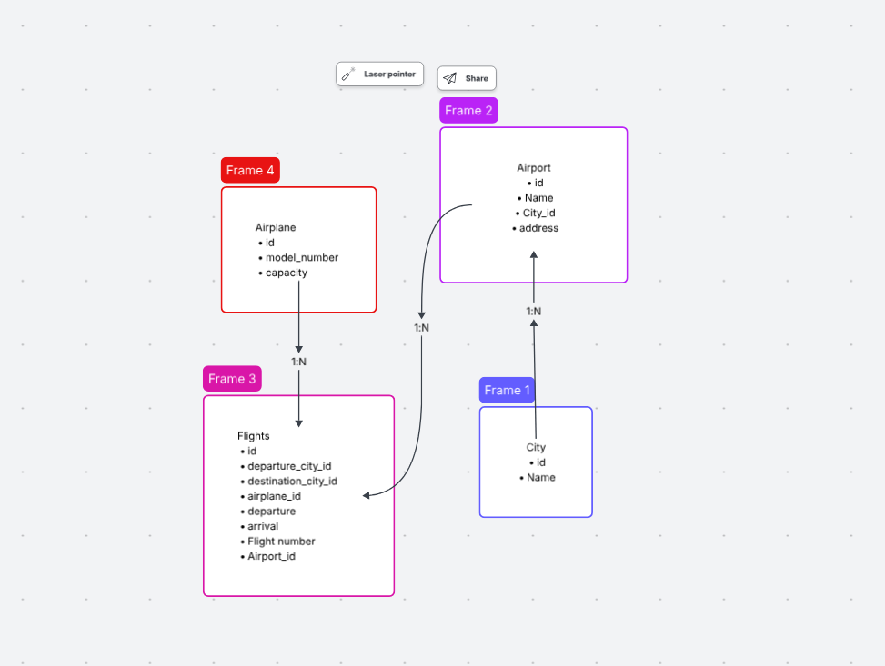

<!-- role based architecture
/
    -src/
        index.js //server
        models/
        controllers/
        middlewares/
        services/
        utils/
        config/ Store important data about data base configurations     
        repository/
    -tests/ [later]
    -statics/
    -temp/   -->

<!-- feature based architecture  -->
/
<!-- -flights
    /models
    /controller
-search
    /models
    /controller -->

# Welcome to Flight services

## Project Setup
- clone the project on your local 
- execute `npm install` on the same path as of your root directory of the downloaded project
- create dotenv file in the root directory and add the following env variables
        - `PORT = 3000`
- Inside the src/config folder, create a new file `config.json` and then add the following piece of json

```
{
  "development": {
    "username": <YOUR_DB_LOGIN_NAME>,
    "password": <YOUR_DB_PASSWORD>,
    "database": "Flights_Search_DB_DEV",
    "host": "127.0.0.1",
    "dialect": "mysql"
  }
}

```

- once you've added your db config as listed above, go to the src folder from youur terminal and execute `npx sequelize db:create
  and then execute 
  npx sequelize db:migrate`


## DB Design
- Airplane table
- Flight
- Airport 

- A flight belongs to an airplane, but one airplane can be used in multile flights
- A city has many airports, but one airport belongs to a city
- One airport can have many flights, but a flight belongs to one airport


